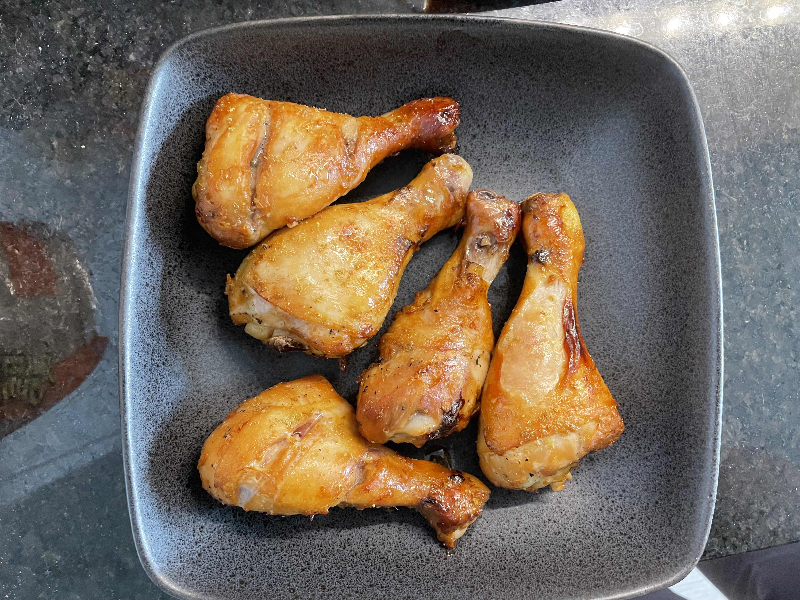

# 照烧鸡腿

> [!WARNING]
>
> 需要提前八小时准备！

## 材料

- [ ] 鸡腿 5枚
- [ ] 生抽
- [ ] 老抽
- [ ] 照烧酱
- [ ] 蜂蜜
- [ ] 蚝油
- [ ] 料酒
- [ ] 黑胡椒
- [ ] 蒜末

## 制作方法

1. 鸡腿改刀 （划两刀），使其更加容易入味
2. 加入以下调料腌制一晚：
   - 生抽 2tbsp
   - 老抽 0.5tbsp
   - 照烧酱 5tbsp
   - 蜂蜜 1tbsp
   - 蚝油 1tbsp
   - 料酒 1tbsp
   - 黑胡椒
   - 蒜末
3. 在烤盘上喷橄榄油
4. 放入腌制好的鸡腿，喷上橄榄油并撒上孜然
5. 放入烤箱，设置350华氏度，烤20分钟后拿出翻面，撒上孜然，继续烤20分钟 （共计40分钟）
6. 完成！